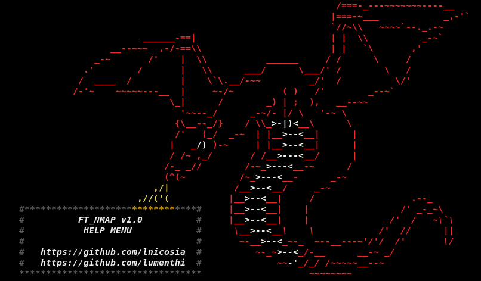
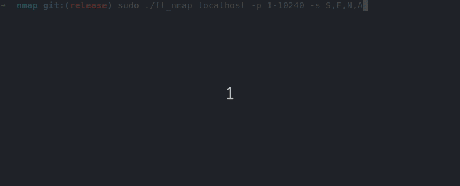

# ft_nmap    
  
This is our ft_nmap program from 42 (https://42.fr/) a low-level networking project, the goal is to re-code a part of the [nmap](https://nmap.org/) utility with some extra features.
## Summary
* [Introduction](#introduction)
* [Demo](#demo)
* [Constraints](#constraints)
* [Features](#features)
* [Scans](#scans)
* [Installation](#installation)
* [Usage](#usage)
* [Examples](#examples)
* [Compatibility](#compatibility)
* [Authors](#authors)
## Introduction
Nmap is a free ports scanner created by Fyodor and distributed by Insecure.org. It is
conceived to detect open ports, identify hosted services and obtain information on the
operating system of a distant computer. This software has become a reference for network
admin because the audit of Nmap reports give indications on the network security. It is
available for Windows, Mac OS X, Linux, BSD and Solaris.
The goal of this project is to code the main features, i.e different types of scans and decent performances.
## Demo
 
## Constraints
The program had to be coded in C. We were supposed to use the libpcap library, but since we are a bit stubborn, we made it from scratch with raw C sockets.
## Features
- Multithreading
- Host discovery (multithreaded as well)
- Masks support, scan an entire network
- Multiple scantypes in one command
- Dynamic timeout
- Supports IP files (.ip)
- Progress bar
- Non root connect scan
- Tester (ft_server)
- Advanced services recognition
- Different verbose levels
- Custom payloads for a better response rate
## Scans
- TCP SYN (Stealth) Scan
- UDP Scan
- TCP FIN, NULL, and Xmas Scans
- TCP Connect Scan
## Installation
Run `make` to compile the project, make will install the required databases and compile the binary `ft_nmap` as well as `ft_server`.
## Usage
Getting started with ft_nmap is easy, simply run `./ft_nmap scanme.org` to scan `scanme.org`.
Since ft_nmap has a lot of options, run `./ft_nmap -h` to display the help menu.
By default, ft_nmap will perform a connect/SYN scan (depending if run with sudo or not) on the first 1024 ports of the target.
## Examples
Here are some more advanced usages for ft_nmap
- `sudo ./ft_nmap localhost --scan=FIN,SYN`
- `sudo ./ft_nmap scanme.org localhost --verbose=INFO -t 50 2>log.txt`
- `sudo ./ft_nmap --file=list.ip -s SYN,FIN,NULL,UDP -t 250`
- `sudo ./ft_nmap 10.0.2.1/24 -t 20 -v`
## Compatibility
This project is only compatible with Linux.
## Authors
Lucas Nicosia (https://github.com/lnicosia)  
Ludovic Menthiller (https://github.com/lumenthi)
